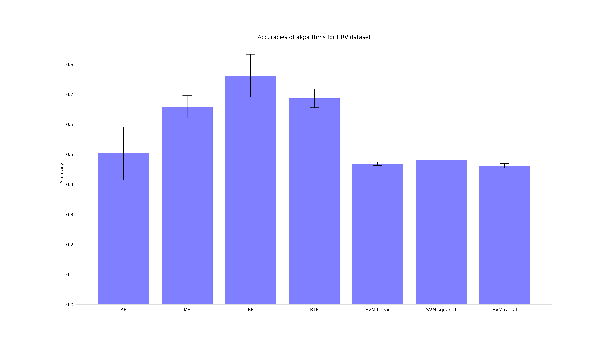
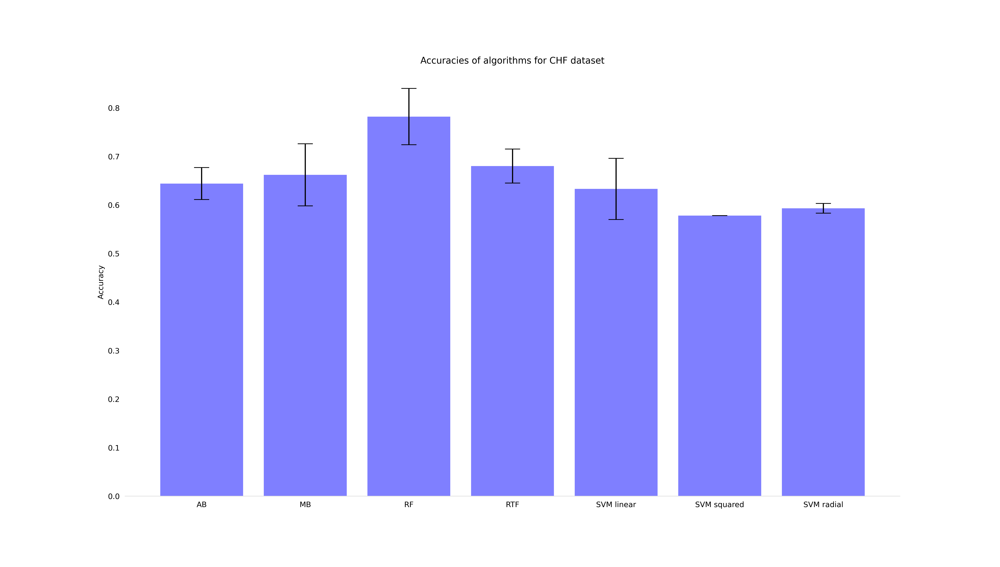

# Decision tree ensembles in biomedical time-series classification 

This code is a recreation of the research conducted in this [article](https://bib.irb.hr/datoteka/586214.51_camera-ready.pdf)

## Resources
I used Adaboost, MultiBoost (as AdaBoost implemented with SAMME algorithm), Random forest, and Support Vector Machines (linear, squared and radial) from [sklearn library](https://scikit-learn.org/stable/index.html) and RotationForest from [here](https://pypi.org/project/rotation-forest/).

## Results summary:

Accuracies of algorithms for Arrhythmia dataset

Accuracies of algorithms for HRV dataset

Accuracies of algorithms for CHF dataset
